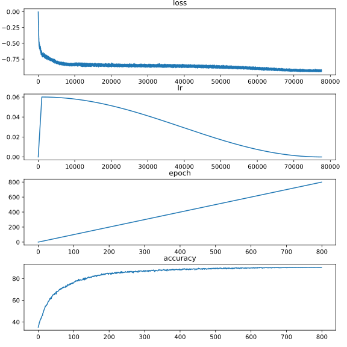

# Adriano's Notes
To run debugging on my SimSiam try this.

```
CUDA_VISIBLE_DEVICES=0 python main.py --data_dir ../Data/ --log_dir ../logs/ -c configs/simsiam_mnist.yaml --ckpt_dir ~/.cache/ --hide_progress --download --debug
```

# Task
Rumen and Peter have given me this repo with a couple tasks as a sort of challenge.
1. https://github.com/PatrickHua/SimSiam -- clone this repository and familiarize yourself
with it,
2. We will do experiments with the MNIST dataset.
3. We would like to define a new transform that does (a) RandomResizedCrop with
probability 1 and (b) Solarization with probability p, which is a hyperparameter we would
like to play with, say p=[0, 0.2, 0.4, 0.6, 0.8, 1.0]. The intuition is that (a) should be very
helpful for contrastive learning and that (b) will not be very helpful, since Solarization flips
dark pixels to white and vice versa, so the variability that it introduces should not be that
helpful. Note that you could write a new transform in ./augmentations/
4. Define a new backbone in ./models/backbones that is suitable for MNIST inputs
5. Use the existing code for contrastive learning (in ./main.py) and the linear protocol (in
./linear_eval.py) to train the above settings.
6. Once you are done, create a new github repository with the code and results and share
it with Peter and me. In case you cannot make the setting run until completion, you can
just share the relevant portions of the code that you have written, and we’ll take a look at
it. It’s OK if you cannot finish, but it’s important how you approach this challenge. Our
github names are “rdangovs” and “peterparity”
7. Ask us questions anytime!
8. There is no deadline for this challenge, but please send it back to us as soon as
possible. The earlier we receive it, the earlier we might write a proposal. If we receive it
very late, we risk not being able to write the proposal in time.
9. Can you do a t-SNE visualization of the features that you learn from your contrastive
learning method? Can you compute the instance-level variability that is coming from the data
augmentation in your learned representations?
10. https://docs.google.com/presentation/d/1T-kWHAwYoNnbumf6cyBJB3cUlrP8xlbFHyd3ccEkNxA/
edit#slide=id.p

# News
It's been two months and I think I've finally discovered the **True** reasons why Simsiam/BYOL avoids collapsed solutions using stop gradient and predictor!!! Follow me on [twitter](https://twitter.com/tianyu_hua) and stay tuned!


# SimSiam
A PyTorch implementation for the paper [**Exploring Simple Siamese Representation Learning**](https://arxiv.org/abs/2011.10566) by Xinlei Chen & Kaiming He


### Dependencies

If you don't have python 3 environment:
```
conda create -n simsiam python=3.8
conda activate simsiam
```
Then install the required packages:
```
pip install -r requirements.txt
```

### Run SimSiam

```
CUDA_VISIBLE_DEVICES=0 python main.py --data_dir ../Data/ --log_dir ../logs/ -c configs/simsiam_cifar.yaml --ckpt_dir ~/.cache/ --hide_progress --download --debug
```
The data folder `../Data/` should look like this:
```
➜  ~ tree ../Data/
├── cifar-10-batches-py
│   ├── batches.meta
│   ├── data_batch_1
│   ├── ...
└── stl10_binary
    ├── ...
```
```
Training: 100%|#################################################################| 800/800 [11:46:06<00:00, 52.96s/it, epoch=799, accuracy=90.3]
Model saved to /root/.cache/simsiam-cifar10-experiment-resnet18_cifar_variant1.pth
Evaluating: 100%|##########################################################################################################| 100/100 [08:29<00:00,  5.10s/it]
Accuracy = 90.83
Log file has been saved to ../logs/completed-simsiam-cifar10-experiment-resnet18_cifar_variant1(2)
```
To evaluate separately:
```
CUDA_VISIBLE_DEVICES=4 python linear_eval.py --data_dir ../Data/ --log_dir ../logs/ -c configs/simsiam_cifar_eval.yaml --ckpt_dir ~/.cache/ --hide_progress --eval_from ~/simsiam-cifar10-experiment-resnet18_cifar_variant1.pth

creating file ../logs/in-progress_0111061045_simsiam-cifar10-experiment-resnet18_cifar_variant1
Evaluating: 100%|##########################################################################################################| 200/200 [16:52<00:00,  5.06s/it]
Accuracy = 90.87
```


>`export DATA="/path/to/your/datasets/"` and `export LOG="/path/to/your/log/"` will save you the trouble of entering the folder name every single time!

### Run SimCLR

```
CUDA_VISIBLE_DEVICES=1 python main.py --data_dir ../Data/ --log_dir ../logs/ -c configs/simclr_cifar.yaml --ckpt_dir ~/.cache/ --hide_progress
```

### Run BYOL
```
CUDA_VISIBLE_DEVICES=2 python main.py --data_dir ../Data/ --log_dir ../logs/ -c configs/byol_cifar.yaml --ckpt_dir ~/.cache/ --hide_progress
```

### TODO

- convert from data-parallel (DP) to distributed data-parallel (DDP)
- create PyPI package `pip install simsiam-pytorch`


If you find this repo helpful, please consider star so that I have the motivation to improve it.


